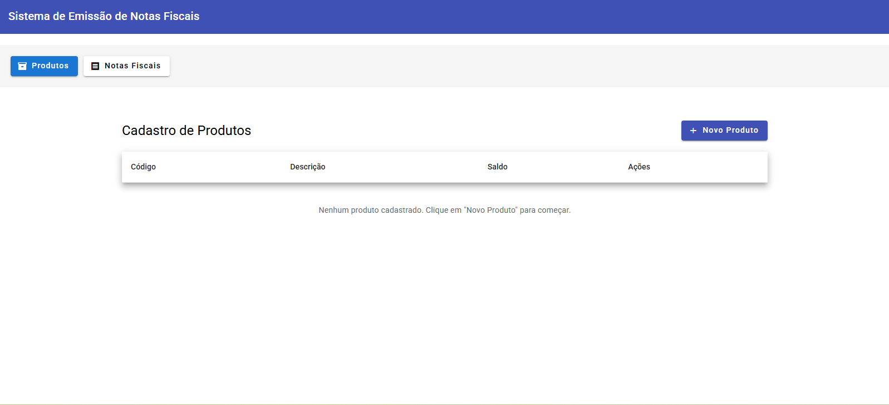
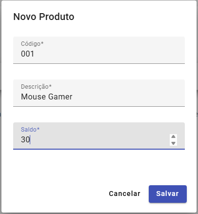
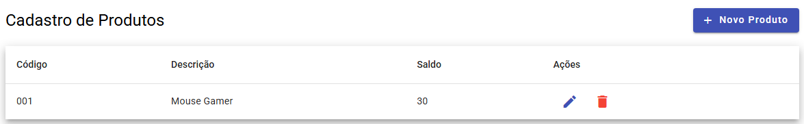
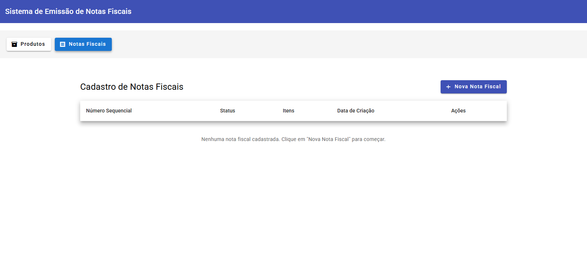
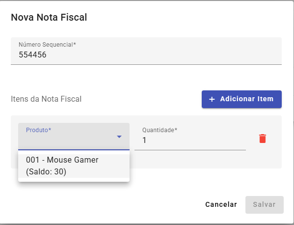
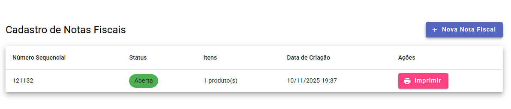

# Korp_Teste - Sistema de Emissão de Notas Fiscais

Sistema completo de emissão de notas fiscais desenvolvido com Angular no frontend e arquitetura de microsserviços em C# .NET no backend.







## Arquitetura

O sistema é composto por:

- **Frontend**: Aplicação Angular
- **Backend**: Arquitetura de microsserviços
  - **Serviço de Estoque**: Gerencia produtos e saldos
  - **Serviço de Faturamento**: Gerencia notas fiscais

## Estrutura do Projeto

```
Korp_Teste/
├── frontend/              # Aplicação Angular
├── backend/
│   ├── EstoqueService/    # Microsserviço de Estoque
│   └── FaturamentoService/ # Microsserviço de Faturamento
└── README.md
```

## Funcionalidades

### Cadastro de Produtos
- Código
- Descrição (nome do produto)
- Saldo (quantidade disponível em estoque)

### Cadastro de Notas Fiscais
- Numeração sequencial
- Status: Aberta ou Fechada
- Inclusão de múltiplos produtos com respectivas quantidades

### Impressão de Notas Fiscais
- Botão de impressão visível e intuitivo
- Indicador de processamento durante a impressão
- Atualização automática do status para "Fechada" após impressão
- Atualização do saldo dos produtos conforme quantidade utilizada
- Validação: não permite impressão de notas com status diferente de "Aberta"

## Requisitos Obrigatórios Implementados

✅ Arquitetura de Microsserviços (Estoque e Faturamento)
✅ Tratamento de Falhas com recuperação e feedback ao usuário

## Requisitos Opcionais Implementados

✅ Tratamento de Concorrência (produtos com saldo limitado)
✅ Idempotência nas operações críticas

## Tecnologias Utilizadas

### Frontend
- Angular (versão mais recente)
- RxJS para gerenciamento de estado e operações assíncronas
- Angular Material para componentes visuais
- HttpClient para comunicação com APIs

### Backend
- C# .NET (ASP.NET Core)
- Entity Framework Core para persistência
- SQLite para banco de dados (pode ser facilmente migrado para SQL Server)
- Swagger/OpenAPI para documentação

## Como Executar

### Pré-requisitos
- Node.js e npm
- .NET SDK 8.0 ou superior
- Angular CLI

### Frontend
```bash
cd frontend
npm install
ng serve
```

### Backend - Serviço de Estoque
```bash
cd backend/EstoqueService
dotnet restore
dotnet run
```

### Backend - Serviço de Faturamento
```bash
cd backend/FaturamentoService
dotnet restore
dotnet run
```

## Detalhamento Técnico

Consulte o arquivo `DETALHAMENTO_TECNICO.md` para informações detalhadas sobre:
- Ciclos de vida do Angular utilizados
- Uso da biblioteca RxJS
- Bibliotecas utilizadas e suas finalidades
- Gerenciamento de dependências
- Frameworks utilizados
- Tratamento de erros e exceções
- Uso de LINQ (se aplicável)

